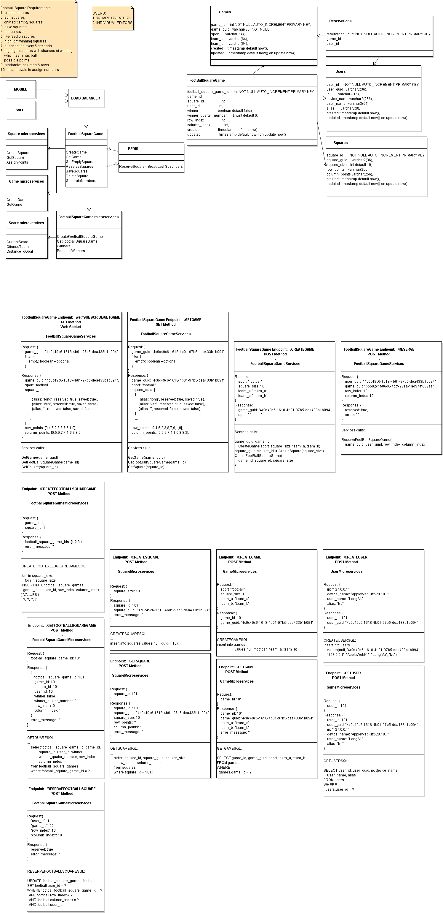

# FootballSquare
FootballSquare is a project designed to allow friends and colleagues to easily create and play Football Squares. Please note that this project is still in progress.

## What is Football Square?
https://www.wikihow.com/Play-Football-Squares

## Why this project?
I created this project to showcase my Golang, Docker, and React skills—proving that I could save the world!... Or a porfolio to show that my work experiences.

## Design

### React Web:
1. FootballSquarePages


### Golang Services:
1. **FootballSquaresLibs**
   * Unified libraries for all services to use
2. **FootballSquareGame**
   * Provide all services related to football square publicly
3. **Internal Services, Microservices**:
   * These services are domain specific service and is used as an internal APIs.  They can access DB for data.
   1. **FootballSquareGameMicroservices**
      * Implemented *Get* and *Create*
   2. **GameMicroservices**
      * Implemented *Get* and *Create*
   3. **SquareMicroservices**
      * Implemented *Get* and *Create*



## Installation
### Prerequisite
1. npm
2. Docker Desktop

To install *npm*, please visit https://docs.npmjs.com/downloading-and-installing-node-js-and-npm

To install *Docker* engine, please visit https://docs.docker.com/engine/install/

After Docker is installed, clone the main project repository and run the setup script to clone all dependent repositories

```sh
#clone starter
git clone git@github.com:longvu727/FootballSquares.git

#change to cloned FootballSquares directory
cd FootballSquares

#clone all other services
./setup.sh

#build services
docker-compose up --build -d

#To start web

#change to FootballSquarePages
cd FootballSquarePages

#Start server
PORT=4000 npm start
```